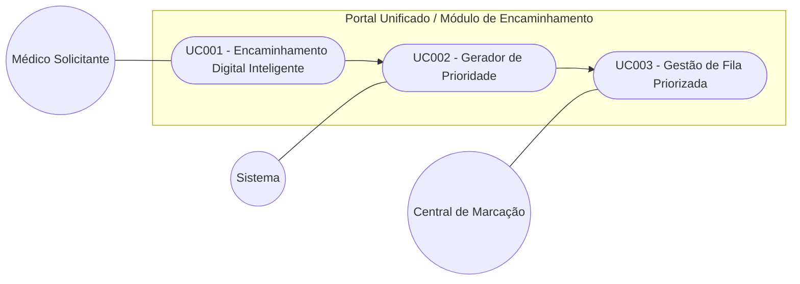

# Modelagem de Casos de Uso

## 1. Diagrama de Casos de Uso
*(Inserir imagem ou Mermaid)*

## 2. Especificação (Exemplo)

### UC001 - Encaminhamento Digital Inteligente
* **Ator**: Médico Solicitante
* **Fluxo**: Acessar Prontuário -> Selecionar Especialidade/Sintomas -> Enviar Solicitação.

#### [CARE-UC001] Integração AGHU e Formulário de Sintomas 
* **Context**: Médico autenticado no portal unificado com um paciente em atendimento.
* **Action**: O sistema deve consumir a API do AGHU para carregar dados do paciente. Após a seleção da especialidade pelo médico, o sistema deve exibir um formulário dinâmico com sintomas baseados em diretrizes clínicas.
* **Result**: Formulário digital preenchido, eliminando a necessidade de transcrição manual ou papel.
* **Evaluation**: Verificar se, ao trocar a especialidade (ex: de Cardiologia para Ortopedia), o formulário de sintomas atualiza corretamente conforme a diretriz.

### UC002 - Gerador de Prioridade
* **Ator**: Sistema 
* **Fluxo**: Receber sintomas -> Calcular Gravidade -> Gerar Pedido.

#### [CARE-UC002] Avaliador de Gravidade
* **Context**: Sintomas selecionados e formulário de encaminhamento enviado pelo médico no UC001.
* **Action**: Processa os sintomas marcados e atribuir automaticamente uma cor de gravidade (Vermelho, Amarelo ou Verde) conforme a PDF já existente.
* **Result**: Pedido de encaminhamento disparado para a Central de Marcação com a gravidade definida.
* **Evaluation**: Validar se a seleção de um sintoma classificado como crítico (ex: "Cegueira") resulta obrigatoriamente na cor "Vermelho" na fila de destino.

### UC003 - Gestão de Fila Priorizada
* **Ator**: Central de Marcação 
* **Fluxo**: Receber Fila Digital -> Visualizar Prioridade -> Realizar Agendamento(no AGHU).
#### [CARE-UC003] - Dashboard de Regulação
* **Context**: Existência de pedidos de encaminhamento processados e classificados pelo UC002.
* **Action**: Apresentar ao operador uma fila digital, organizada automaticamente por ordem de gravidade clínica, exibindo os dados do paciente de forma legível e estruturada.
* **Result**: Eliminação do uso de papel e de marcações incorretas, permitindo o agendamento baseado em prioridade real.
* **Evaluation**: O operador deve conseguir identificar e abrir o caso de maior risco no topo da lista sem realizar triagem manual ou filtros adicionais.

